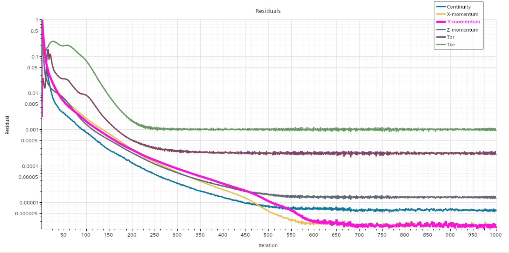
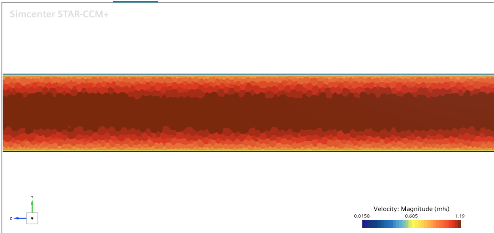

# Pipe Flow CFD

## Objective

Study the flow and pressure drop in a circular pipe using STAR-CCM+.

The main objective is to calculate the pressure drop ΔP along the pipe.

## Geometry

- Pipe diameter: 20 mm (0.02 m)
- Pipe length: 1000 mm (1 m)
- Geometry: Circular pipe

## Fluid

- Water
- Temperature: 20 °C

## Boundary Conditions

- Inlet: Velocity Inlet
- Inlet velocity: 1 m/s
- Outlet: Pressure Outlet
- Outlet gauge pressure: 0 Pa
- Wall: No-slip

## Mesh

- Number of Cells: 662,947
- Number of Faces: 2,974,031
- Number of Vertices: 1,864,663

## Physics

- Steady flow
- Incompressible flow
- Segregated Flow
- Constant Density
- Turbulent Flow
- Realizable K-Epsilon Two-Layer
- Two-Layer All y+ Wall Treatment
- Water

## Solver

- Maximum iterations: 1000

The residuals decreased significantly during the simulation
and reached a relatively stable level.

## Results

### Velocity Field

The calculated velocity magnitude ranges approximately from:

- Minimum: 0.0158 m/s
- Maximum: 1.19 m/s

The velocity is higher in the central region of the pipe
and decreases toward the wall.

ZB: 09-06 15:55:36
# Pipe Flow CFD

## Objective

Study the flow and pressure drop in a circular pipe using STAR-CCM+.

The main objective is to calculate the pressure drop ΔP along the pipe.

## Geometry

- Pipe diameter: 20 mm (0.02 m)
- Pipe length: 1000 mm (1 m)
- Geometry: Circular pipe

## Fluid

- Water
- Temperature: 20 °C

## Boundary Conditions

- Inlet: Velocity Inlet
- Inlet velocity: 1 m/s
- Outlet: Pressure Outlet
- Outlet gauge pressure: 0 Pa
- Wall: No-slip

## Mesh

- Number of Cells: 662,947
- Number of Faces: 2,974,031
- Number of Vertices: 1,864,663

## Physics

- Steady flow
- Incompressible flow
- Turbulent flow
- Water

## Solver

- Maximum iterations: 1000

The residuals decreased significantly during the simulation
and reached a relatively stable level.

## Results

### Velocity Field

The calculated velocity magnitude ranges approximately from:

- Minimum: 0.0158 m/s
- Maximum: 1.19 m/s

The velocity is higher in the central region of the pipe
and decreases toward the wall.

### Pressure Drop

The pressure-drop monitor reaches a stable value after the initial
transient numerical adjustment.

Final pressure drop:

**ΔP ≈ 601.3 Pa**

## Conclusion

The CFD simulation successfully reproduced the internal flow
in a circular pipe.

The velocity distribution shows the expected behavior of pipe flow,
with lower velocity near the wall and higher velocity in the
central region.

The residuals and pressure-drop monitor indicate that the solution
reached a stable state.

The pressure drop along the pipe is approximately 1 kPa.

## Results Visualization

### Residuals

### Pressure Drop

### Velocity Contour

